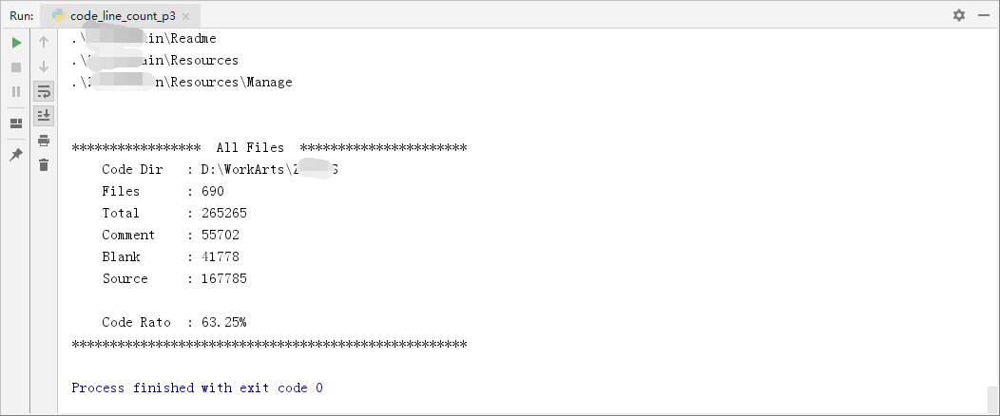

# CodeLineCount

## Description

该程序是一个python3版本的C#工程的代码统计项目。并非原创，但也更改和优化了大量代码段。
并将pthon2版本的程序，优化到现在能用的地步。
该项目统计时，排除了.Designer.cs等类型的文件。代码浅显易懂，方便修改。
欢迎star。

该程序当前可以计算如下格式的代码文件：
* .cs
* .cpp
* .h
* .py

## Imgages captured

## Version 

v1.0
weng
18.11.1 2228